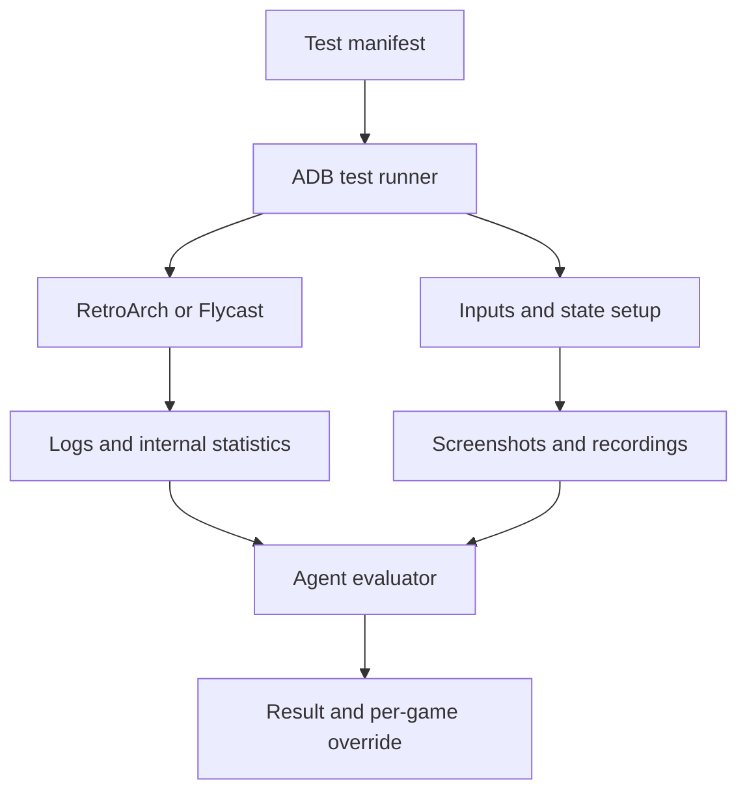

# N64 and Dreamcast Automated Emulator Validation Design

**Status:** PARTIAL — see [status legend](README.md#status-legend); design
complete, Phase 1 harness not yet built. See
[runbooks/emulation/n64-dreamcast-optimization.md](../runbooks/emulation/n64-dreamcast-optimization.md)
for the operational per-platform/per-game procedure this design supports.

## Connectivity model (resolved 2026-09-22)

ADB connectivity here is **session-based, established fresh each time a
testing session starts** — `adb connect <current LAN IP>:5555`, run
interactively with the operator present to approve/reconnect as needed.
This is deliberately different from (and does not need) a persistent,
always-on background connection: an earlier attempt to build exactly that
for a different purpose (auto-regenerating RetroArch playlists on R-Shop
library changes, see
[hosts/fire-tv-stick/README.md](../hosts/fire-tv-stick/README.md)) was
reverted specifically because a standing connection needs a DHCP
reservation and breaks whenever the Fire TV Stick travels off the home
network. That constraint doesn't apply to on-demand testing sessions run
while the stick is home — no DHCP reservation is required, and the
connection doesn't need to survive unattended.

## Known input-automation constraint (confirmed elsewhere in this repo)

The "Automated Input and State Control" section below lists `adb shell
input keyevent` menu-path automation as an acceptable fallback for Tier 1
boot tests. **This does not work for RetroArch and should not be relied
on.** Already confirmed the hard way during this project's Fire TV remote
work: RetroArch reads raw input devices directly rather than synthetic
Android key events, which is the same root cause that made Fire TV remote
support unworkable and led to abandoning it entirely (see
[hosts/fire-tv-stick/README.md](../hosts/fire-tv-stick/README.md)'s
"RetroArch: gamepad-only, remote support abandoned" section). Practical
effect for this design: **every automated test must launch directly into
content via Android launch-intent extras** (`ROM`/`LIBRETRO`/
`CONFIGFILE`/`QUITFOCUS`/`REFRESH` for RetroArch — confirmed exhaustively
against `RetroActivityFuture.java`/`RetroActivityCommon.java` source),
never by navigating RetroArch's own menu. This isn't a fallback choice
between two working options, it's the only one that works; treat "prefer
direct emulator launch intents" (Automated Input and State Control,
below) as a hard requirement, not a preference.

## Purpose

This document defines the configuration baseline and automated testing workflow for Nintendo 64 and Sega Dreamcast emulation on the Fire TV Stick 4K Max. The system should let an agent launch games, exercise repeatable test scenarios, observe the screen, collect logs and performance telemetry, classify failures, test conservative configuration changes, and write per-game overrides.

The optimization order is:

1. Correct boot and rendering.
2. Stable full-speed emulation and frame pacing.
3. Clean audio and reliable input.
4. Higher internal resolution and optional visual improvements.

The agent must not trade stable speed for cosmetic improvements.

## Established Configuration Baseline

### Shared Fire TV Settings

- Prefer Vulkan wherever the selected emulator or core is stable with it.
- Rewind: off.
- Run-Ahead: off.
- Heavy shaders: off.
- RetroArch Threaded Video: off initially; enable only as a tested override.
- Frame Skip: off by default.
- Audio latency: start at 64 ms; test 96 ms and then 128 ms if audio crackles.
- Enable TV Game Mode or ALLM.
- Do not attempt to overclock the Fire TV Stick.
- Defer expensive shaders, texture packs, heavy filtering, and high-resolution enhancement to the future mini-PC and Sunshine/Moonlight path.

### Nintendo 64

- Candidate cores: ParaLLEl and Mupen64Plus-Next.
- Start at approximately 480p internal resolution when the game remains full speed.
- Fall back to approximately 240p or native-like resolution for difficult games.
- Expect per-game core and resolution overrides.

When a game fails a performance test, tune it in this order:

1. Lower internal resolution.
2. Test the alternate core.
3. Disable remaining enhancements.
4. Enable frame skip only as a last resort and only for that game.

### Sega Dreamcast

- **Start with the RetroArch Flycast core, escalate to standalone Flycast
  on specific real problems** (revised 2026-09-22 — a practical override
  of the research-based "default to standalone" recommendation below,
  made deliberately: the RetroArch core is already sideloaded and
  testable right now, while standalone Flycast needs a new APK sourced
  and sideloaded first. Start with the zero-friction option; escalate only
  if it actually earns it).
  - Concrete escalation triggers, from the research (moderate confidence,
    not proven with device-specific numbers):
    - Rendering that looks visibly blurrier or otherwise different than
      expected at a given resolution — two open upstream issues document
      exactly this for the RetroArch core vs. standalone
      (flyinghead/flycast#1007, #1308).
    - A specific game with a known bug already fixed upstream in
      `flyinghead/flycast` but not yet in what RetroArch ships —
      `libretro/flycast` (the core RetroArch ships) is itself marked
      **deprecated** by upstream, and real-world packaging still lags
      behind current upstream in practice (e.g. RetroPie's `lr-flycast`
      needed a separate `-dev` variant to track current).
    - Needing robust save-state/rewind support specifically — don't
      expect the RetroArch core to have this "for free" as a frontend
      integration advantage; it doesn't (`libretro/RetroArch#17779` is a
      still-open feature request asking for it), so this isn't actually a
      reason to prefer the RetroArch core either.
  - No FPS/frame-time numbers exist anywhere for either option on this
    exact hardware (Fire TV Stick 4K Max / 2GB-RAM-class Android TV) — a
    real evidence gap either way. Validate empirically per this doc's own
    Controlled Tuning Loop once real testing starts, rather than trusting
    this write-up alone.
- Renderer: Vulkan.
- Threaded rendering: on only where testing confirms a benefit without instability.
- Frame Skip: off by default and enabled only for specific demanding games.

## Measurement Strategy

### Primary Emulator Telemetry

For RetroArch tests, enable its running statistics display. The useful fields include:

- Core requested FPS.
- Actual video output FPS.
- Configured display refresh.
- Audio underrun percentage.
- Audio blocking percentage.
- Total rendered frames when available.

These internal measurements are the primary performance evidence. The agent should capture the display and extract the values using OCR or vision analysis. It should sample multiple frames rather than trusting a single screenshot.

The agent must interpret the values correctly. A game designed for 30 rendered gameplay frames per second may still report a roughly 60 Hz core or video rate because some cores internally double frames. Passing therefore means that actual video output stays close to the rate requested by the core, not that every title literally reports 60 gameplay frames per second.

### Screen Observation

Use ADB for visual capture:

```bash
adb exec-out screencap -p > screen.png
adb shell screenrecord --size 1280x720 --bit-rate 6000000 --time-limit 60 /sdcard/emulator-test.mp4
adb pull /sdcard/emulator-test.mp4
```

The agent should use screenshots for state detection and overlay OCR, and short recordings for motion, frame-pacing, flicker, graphical corruption, and freeze detection. Android screen recording does not capture audio, so audio health must be inferred from RetroArch statistics, logs, and a later human listening pass.

Screen recording adds work to the device and can affect performance. Run each performance scenario once with recording disabled for authoritative telemetry and, when useful, a second time with recording enabled for visual diagnosis.

### Logs and Process Health

Enable RetroArch logging verbosity, log-to-file, timestamps, and appropriate frontend and core logging levels. Collect the RetroArch log after each scenario. Also capture a filtered Android log stream around launch and shutdown:

```bash
adb logcat -c
adb logcat -v threadtime > logcat.txt
```

The harness should separately track:

- Whether the expected emulator process started.
- Whether it remained alive for the requested test duration.
- Exit status or disappearance of the process.
- Android crash, ANR, Vulkan, EGL, audio, storage, permission, and core errors.
- Whether RetroArch returned to its menu or Fire TV returned to the launcher unexpectedly.

### Supporting Device Telemetry

Fire TV System X-Ray can expose display, CPU, memory, and network information over the screen. Its stored metrics can also be queried through the Fire TV developer service on supported software versions. Use this for thermal or resource-pressure context, not as the primary emulator-speed measurement.

Android `dumpsys gfxinfo <package> framestats` may provide frame timing for application UI rendering. Treat it as supporting evidence only: it may not represent the libretro core's requested rate or the emulator's internal speed accurately.

Amazon's Advanced Options overlay reports playback frame rate, dropped frames, and resolution when Android MediaCodec is active. Emulator output rendered through Vulkan or OpenGL normally does not use MediaCodec, so this overlay should not be assumed to measure N64 or Dreamcast emulation.

## Automation Architecture

The controller should run from Overmind or the development laptop and communicate with the Fire TV through ADB over the local network.



The implementation should separate orchestration from evaluation:

- The runner launches software, sends inputs, waits, captures artifacts, and restores a clean state.
- The evaluator parses numeric telemetry, searches logs, compares screenshots, inspects recordings, and assigns a result.
- The tuner chooses the next permitted configuration from an explicit search ladder.
- A human reviews uncertain results and approves any global-default changes.

## Per-Game Test Manifest

Each game should have a machine-readable manifest in YAML or JSON. A minimal record should include:

```yaml
game_id: n64.example-game.usa
system: n64
content_path: /roms/n64/Example Game.z64
emulator: retroarch
core: parallel_n64
profile: n64-480p-baseline
expected_boot_seconds: 20
scenarios:
  - id: boot
    duration_seconds: 30
  - id: gameplay
    checkpoint: test-fixtures/n64.example-game.usa/gameplay.state
    input_script: test-fixtures/n64.example-game.usa/gameplay.yaml
    warmup_seconds: 30
    sample_seconds: 120
```

Store the emulator version, core version, configuration hash, ROM hash, region, and test-fixture version with every result. Save states can break across emulator or core updates, so a checkpoint must be invalidated or reviewed whenever its associated version changes.

## Test Scenarios

### Tier 1 Boot Sweep

Run this inexpensive test across the whole candidate library:

1. Reset logs and terminate stale emulator processes.
2. Launch the game with the intended emulator and core.
3. Wait for the expected boot interval.
4. Capture screenshots at fixed checkpoints.
5. Confirm the emulator remains alive.
6. Detect a known title screen, menu, gameplay image, or other nonblank output.
7. Collect logs and exit cleanly.

Classify obvious failures such as crash, ANR, black screen, frozen boot, missing content, missing BIOS, invalid core, permission failure, or graphical corruption. A boot pass means only that the game reached a recognizable interactive state.

### Tier 2 Representative Gameplay

Use a known checkpoint and repeatable input sequence to reach a demanding, representative section:

1. Load a version-matched save state or save file.
2. Run a short scripted controller sequence to verify input and advance into gameplay.
3. Allow a warm-up period so compilation and startup transients do not dominate the sample.
4. Run the scenario without screen recording and collect internal statistics.
5. Repeat with screenshots or a short recording when visual inspection is needed.
6. Check for progression rather than merely checking that successive screenshots differ.

Useful scenarios include normal gameplay, a demanding area, a cutscene, pause and resume, save and load, and clean shutdown. N64 and Dreamcast titles should receive curated representative scenarios rather than random inputs alone.

### Tier 3 Soak and Regression

Run longer tests only for the default profile, known difficult titles, and games affected by an emulator update. Check for memory growth, eventual crash, audio underrun, thermal throttling, controller loss, save corruption, and performance degradation.

## Automated Input and State Control

The first implementation may send Fire TV remote or keyboard events with `adb shell input keyevent`. Prefer direct emulator launch intents and stable content paths once their behavior is validated; otherwise automate the smallest possible menu path.

For gameplay, use one of these fixture types in order of preference:

1. A known save file plus a short navigation script.
2. A version-pinned save state plus a short input script.
3. A deterministic emulator input replay if the chosen core and frontend support it reliably.
4. Timed ADB key events for simple smoke tests.

ADB key events alone are suitable for boot and menu automation but are not precise enough to be the only mechanism for long, deterministic gameplay benchmarks.

## Evaluation and Classification

Each scenario should produce both structured measurements and an agent-readable summary.

### Suggested Statuses

- `pass`: Meets the selected profile without a game-specific override.
- `pass_with_override`: Meets requirements with a documented per-game override.
- `degraded`: Playable but contains a known performance or rendering defect.
- `manual_review`: Evidence is ambiguous or the automated scenario cannot verify gameplay.
- `fail_boot`: Does not reach an interactive state.
- `fail_crash`: Emulator or core crashes or produces an ANR.
- `fail_performance`: Cannot maintain acceptable speed after permitted tuning.
- `fail_graphics`: Severe rendering corruption or persistent blank output.
- `fail_input`: Required controller actions are not recognized reliably.

### Performance Rules

Define thresholds in a versioned test policy rather than embedding them permanently in the runner. An initial policy should require:

- Actual output FPS remains close to the core-requested FPS after warm-up.
- No sustained nonzero audio underrun or blocking condition.
- No crash, ANR, or unexpected process exit.
- No prolonged freeze or blank output during the sampled scenario.
- No severe visual corruption.

Record median, low percentile, minimum, and time below threshold when sampling can support them. Do not reduce a result to average FPS alone; recurring frame-pacing failures can be hidden by an acceptable average.

### Visual Rules

Vision analysis should flag, but not automatically rewrite configuration for:

- Black or single-color screens after the boot window.
- Static frames lasting beyond an allowed interval.
- Repeated flicker.
- Missing geometry, broken textures, or large corrupted regions.
- Error dialogs or unexpected return to the launcher.
- Incorrect aspect ratio, cropping, or rotation.
- Menus that render correctly while gameplay remains blank.

Retain the evidence image or short clip for every failure and every low-confidence classification.

## Controlled Tuning Loop

The agent may only test changes listed in the system's tuning ladder. It should change one variable at a time, rerun the same scenario, and compare against the same baseline.

For N64:

1. Baseline core at approximately 480p.
2. Same core at approximately 240p or native-like resolution.
3. Alternate core at approximately 480p.
4. Alternate core at approximately 240p or native-like resolution.
5. Disable remaining enhancements.
6. Test frame skip only if all earlier profiles fail.

For Dreamcast (baseline flipped back to RetroArch-core-first 2026-09-22 —
zero-friction starting point, already sideloaded; see the Established
Configuration Baseline section above for the concrete escalation
triggers):

1. RetroArch Flycast core baseline with Vulkan.
2. Standalone Flycast with Vulkan (escalate here on rendering defects,
   a game with an upstream-only fix, or other concrete problems — not
   as a default first step).
3. Test threaded rendering where available.
4. Reduce internal resolution or enhancements.
5. Test frame skip only for the individual title.

The agent should select the least exceptional passing profile. Global settings must remain conservative; one problematic title should create a per-game override rather than weakening the default for the rest of the library.

## Result Record

Write one structured result per game, profile, scenario, and software version. Include:

- Game ID, title, region, and ROM hash.
- Device model and Fire OS version.
- Emulator, core, and version identifiers.
- Configuration profile and configuration hash.
- Scenario and fixture versions.
- Launch time and whether the target state was reached.
- Core-requested FPS and actual video FPS samples.
- Audio underrun and blocking samples.
- Process, crash, and ANR findings.
- Visual findings and confidence.
- Supporting CPU and memory observations.
- Artifact paths for logs, screenshots, and recordings.
- Final status, selected override, and rationale.

Generate a compatibility matrix from these records rather than maintaining the matrix manually.

## Human Review Boundary

Automation can detect crashes, persistent slowdowns, obvious corruption, and many configuration regressions. It cannot fully judge input feel, audio quality, transient stutter, game correctness, or whether a test scene is representative. A short human acceptance pass remains required for:

- The final global N64 and Dreamcast profiles.
- Games marked degraded or low confidence.
- Controller latency and hotkey behavior.
- Audio crackle or desynchronization.
- High-priority games before release to the household library.

## Controller and UX Validation

Verify separately that:

- Bluetooth controllers reconnect reliably.
- Player 1 and Player 2 assignments remain stable.
- Menu, quit, and save-state shortcuts behave predictably.
- Emulator hotkeys do not collide with Fire TV Home or Back.
- Navigation remains usable from the couch without a keyboard.

## Implementation Phases

### Phase 1 Harness

- Establish ADB connectivity and device identity checks.
- Discover and record the RetroArch and Flycast package and activity names.
- Implement launch, terminate, screenshot, screen-recording, logcat, and artifact collection commands.
- Enable RetroArch statistics and file logging in a dedicated test profile.
- Prove one N64 and one Dreamcast boot test end to end.

### Phase 2 Measurement

- Parse RetroArch logs.
- Extract internal statistics from repeated screenshots.
- Add process, crash, ANR, blank-screen, and freeze detection.
- Record configuration and content hashes.
- Produce the first machine-readable result records.

### Phase 3 Repeatable Gameplay

- Define the manifest schema.
- Create representative save-state or save-file fixtures.
- Add input scripts and state verification.
- Run baseline-versus-alternate profile comparisons.

### Phase 4 Tuning and Reporting

- Implement the controlled N64 and Dreamcast tuning ladders.
- Generate per-game override files only from passing results.
- Build the compatibility matrix and regression report.
- Require human approval before changing global defaults.

## Remaining Decisions

- Select the default N64 core after representative-game testing.
- Choose the exact structured-result and manifest schemas.
- Confirm reliable Android launch intents for RetroArch content and standalone Flycast.
- Determine whether RetroArch statistics can be collected from a file or API on this build; otherwise standardize overlay OCR.
- Determine which Flycast internal statistics are exposed on the Android build; otherwise use visual and supporting device telemetry.
- Select the initial representative N64 and Dreamcast test set.
- Finalize controller mappings and hotkeys.
- Establish the initial performance thresholds after measuring known-good games.

## Primary References

- [RetroArch Optimal Vsync Performance](https://docs.libretro.com/guides/optimal-vsync/)
- [RetroArch Logging Guide](https://docs.libretro.com/guides/generating-retroarch-logs/)
- [Android Debug Bridge](https://developer.android.com/tools/adb)
- [Android dumpsys](https://developer.android.com/tools/dumpsys)
- [Fire TV Developer Tools Menu](https://developer.amazon.com/docs/fire-tv/developer-tools.html)
- [Flycast](https://github.com/flyinghead/flycast)
